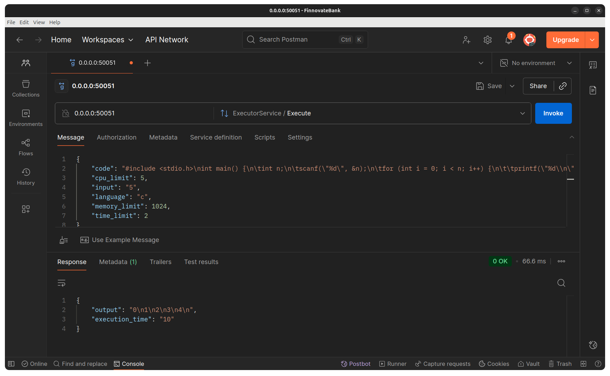

# GoJudge 🚀

Blazingly Fast & Secure Code Execution Platform Powered by nsjail 🔥🛡️

---

## Overview

GoJudge is a high-performance, secure, and extensible code execution engine designed for online judges, code runners, and educational platforms. It leverages [nsjail](https://github.com/google/nsjail) for robust sandboxing, ensuring every code execution is isolated, safe, and resource-limited.

- **Languages Supported:** Python, C, C++, Go
- **API:** gRPC-based for lightning-fast communication
- **Security:** Each submission runs in a hardened nsjail sandbox
- **Performance:** Optimized for minimal overhead and rapid execution
- **Containerized:** Easy deployment with Docker

---

## Features ✨

- **gRPC API:** Modern, efficient, and scalable interface for code execution
- **Multi-language Support:** Python, C, C++, Go (easily extendable)
- **Resource Limits:** Time, memory, and CPU restrictions per execution
- **Postman Collection:** Ready-to-use API samples ([see below](#api-sample))
- **Dockerized:** One-command setup for local or cloud environments
- **Makefile:** Simple build, run, and clean commands

---

## Architecture 🏗️

- **`cmd/server/main.go`:** gRPC server entrypoint
- **`internal/executor/`:** Language-specific execution logic, all sandboxed with nsjail
- **`proto/`:** Protocol Buffers definitions for the gRPC API
- **`Dockerfile` & `docker-compose.yml`:** Containerization and orchestration
- **`Makefile`:** Build and automation scripts

---

## Quick Start 🚦

### 1. Build & Run with Docker

```sh
docker build -t gojudge .
docker run -p 50051:50051 gojudge
```

### 2. Local Development

```sh
make build
make run
```

### 3. Generate gRPC Code

```sh
make proto
```

---

## API Sample (Postman) 📬



---

## gRPC Request Examples 🛰️

### 1. Using Go Client

```go
package main

import (
	"context"
	"log"
	"google.golang.org/grpc"
	pb "huseynovvusal/gojudge/internal/proto"
)

func main() {
	conn, err := grpc.Dial("localhost:50051", grpc.WithInsecure())
	if err != nil {
		log.Fatalf("did not connect: %v", err)
	}
	defer conn.Close()
	client := pb.NewExecutorServiceClient(conn)

	req := &pb.ExecutorRequest{
		Code:      "print('Hello, World!')",
		Input:     "",
		Language:  "python",
		TimeLimit: 2,
		MemoryLimit: 256,
		CpuLimit: 1,
	}
	resp, err := client.Execute(context.Background(), req)
	if err != nil {
		log.Fatalf("Execution error: %v", err)
	}
	log.Printf("Output: %s", resp.Output)
	log.Printf("Execution Time: %d ms", resp.ExecutionTime)
}
```

### 2. Using grpcurl

```sh
grpcurl -plaintext -d '{"code":"print(\"Hello, World!\")","input":"","language":"python","time_limit":2,"memory_limit":256,"cpu_limit":1}' \
  localhost:50051 executor.ExecutorService/Execute
```

---

## Why GoJudge? 🤔

- **Blazingly Fast:** Minimal overhead, instant response
- **Hardened Security:** nsjail ensures every execution is isolated
- **Extensible:** Add new languages or features with ease
- **Production Ready:** Containerized, scalable, and robust

---

## Contributing 🤝

We welcome contributions from everyone! Please read our [CONTRIBUTING.md](CONTRIBUTING.md) for detailed guidelines on how to get started, code style, submitting pull requests, and our review process.

- **Issues & Suggestions:** Open an issue for bugs, feature requests, or questions.
- **Pull Requests:** Fork the repo, create a feature branch, and submit a PR. All contributions are reviewed and discussed before merging.
- **Code Style:** Follow the conventions described in CONTRIBUTING.md for consistency and quality.
- **Communication:** Be respectful and constructive in all interactions.

---

Pull requests and issues are welcome! For major changes, please open an issue first to discuss what you would like to change.

---

## Author

[Huseynov Vusal](https://github.com/huseynovvusal)
